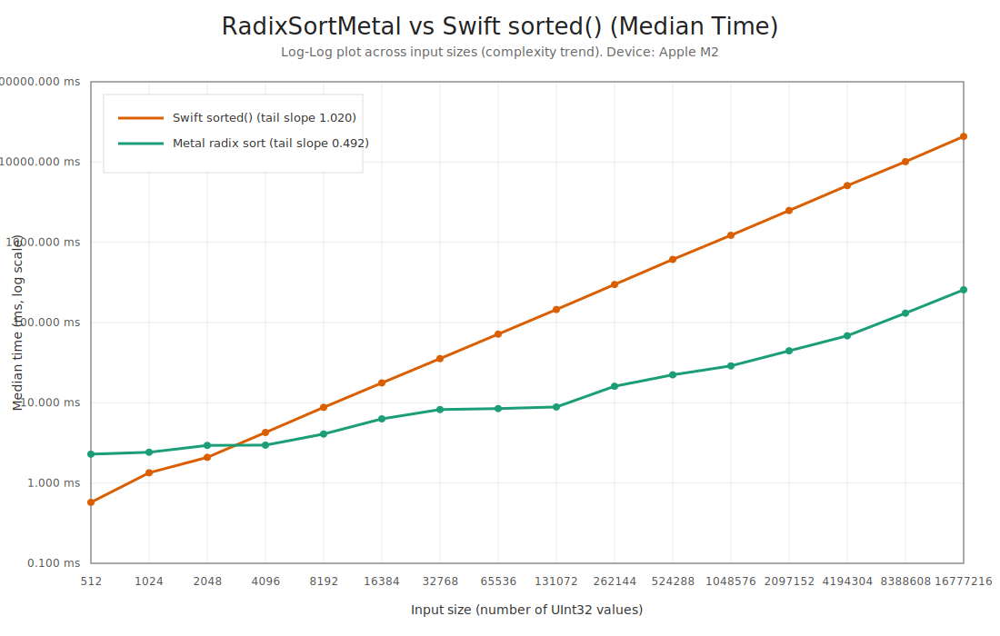

# RadixSortMetal

High-performance, stable GPU radix sort for `UInt32` on Apple GPUs (Metal), packaged as a Swift library.

`RadixSortMetal` is designed for pipelines where you need to:
- sort keys on GPU,
- generate permutation indices,
- reorder one or many payload buffers/arrays using those indices.

## Why Use This Library

- Stable 32-bit radix sort (4 passes, 8 bits/pass).
- Built for Apple GPU workflows with Metal command encoding control.
- Three integration modes:
  - direct call,
  - append to existing `MTLCommandBuffer`,
  - append to existing `MTLComputeCommandEncoder`.
- Supports both Swift arrays and `MTLBuffer` APIs.
- Explicit index output for associated-data reordering.
- Tested with fixed and randomized suites.

## Requirements

- macOS 13+
- Metal-capable Apple device
- Swift tools 6.0 (`Package.swift`)

## Installation (Swift Package Manager)

Add dependency:

```swift
.package(url: "https://github.com/<your-org>/RadixSortMetal.git", branch: "main")
```

Then add product dependency:

```swift
.product(name: "RadixSortMetal", package: "RadixSortMetal")
```

## Quick Start (Array API)

```swift
import RadixSortMetal

let sorter = try MetalRadixSorter()

let keys: [UInt32] = [9, 3, 12, 3, 1]
let indexed = try sorter.sortWithIndices(keys)
// indexed.values  -> [1, 3, 3, 9, 12]
// indexed.indices -> permutation, where indices[newPosition] = originalPosition

let payloadA = [90, 30, 120, 31, 10]
let reorderedA = try sorter.reorder(values: payloadA, indices: indexed.indices)

var payloadB = [SIMD2<Float>(9, 0), SIMD2<Float>(3, 0), SIMD2<Float>(12, 0), SIMD2<Float>(3, 1), SIMD2<Float>(1, 0)]
try sorter.reorderInPlace(&payloadB, indices: indexed.indices)
```

Full per-function API reference (parameters + examples):
- See `Documentation.md` and `Documentation/API/`.

## Integration Modes

### Reorder Behavior

- `reorder(buffer:indexBuffer:...)` is logically in-place but internally uses a scratch path:
  - gather `buffer -> scratch`, then copy `scratch -> buffer`.
  - if you do not provide a temporary buffer, the scratch buffer is allocated for the call.
- `reorder(buffer:temporaryBuffer:indexBuffer:...)` uses the same two-step path, but reuses your provided `temporaryBuffer` to avoid per-call allocation overhead.
- `reorder(sourceBuffer:destinationBuffer:indexBuffer:...)` is direct gather `source -> destination` (single kernel pass, no copy-back).
- `temporaryBuffer` must be distinct from `buffer` and large enough for `count * elementStride` bytes.

### 1) Direct Call

Use when you want the library to create/commit/wait on the command buffer.

```swift
try sorter.sort(buffer: keyBuffer, count: count)
try sorter.sort(buffer: keyBuffer, indexBuffer: indexBuffer, count: count)
try sorter.reorder(buffer: payloadBuffer,
                   indexBuffer: indexBuffer,
                   elementStride: MemoryLayout<SIMD3<Float>>.stride,
                   count: count) // internal: payloadBuffer -> transient scratch -> payloadBuffer
try sorter.reorder(buffer: payloadBuffer,
                   temporaryBuffer: payloadScratchBuffer,
                   indexBuffer: indexBuffer,
                   elementStride: MemoryLayout<SIMD3<Float>>.stride,
                   count: count) // internal: payloadBuffer -> payloadScratchBuffer -> payloadBuffer
```

### 2) Append to `MTLCommandBuffer`

Use when sorting/reordering should be part of your existing GPU frame step.

```swift
let commandBuffer = commandQueue.makeCommandBuffer()!

try sorter.encodeSort(buffer: keyBuffer, indexBuffer: indexBuffer, count: count, into: commandBuffer)
try sorter.encodeReorder(buffer: payloadBuffer,
                         indexBuffer: indexBuffer,
                         elementStride: MemoryLayout<SIMD3<Float>>.stride,
                         count: count,
                         into: commandBuffer) // internal: payloadBuffer -> transient scratch -> payloadBuffer
try sorter.encodeReorder(buffer: payloadBuffer,
                         temporaryBuffer: payloadScratchBuffer,
                         indexBuffer: indexBuffer,
                         elementStride: MemoryLayout<SIMD3<Float>>.stride,
                         count: count,
                         into: commandBuffer) // internal: payloadBuffer -> payloadScratchBuffer -> payloadBuffer

commandBuffer.commit()
```

### 3) Append to `MTLComputeCommandEncoder`

Use when you want encoding inside an already-open compute encoder scope.

```swift
let commandBuffer = commandQueue.makeCommandBuffer()!
let encoder = commandBuffer.makeComputeCommandEncoder()!

try sorter.encodeSort(buffer: keyBuffer, indexBuffer: indexBuffer, count: count, using: encoder)
try sorter.encodeReorder(buffer: payloadBuffer,
                         indexBuffer: indexBuffer,
                         elementStride: MemoryLayout<SIMD3<Float>>.stride,
                         count: count,
                         using: encoder) // internal: payloadBuffer -> transient scratch -> payloadBuffer
try sorter.encodeReorder(buffer: payloadBuffer,
                         temporaryBuffer: payloadScratchBuffer,
                         indexBuffer: indexBuffer,
                         elementStride: MemoryLayout<SIMD3<Float>>.stride,
                         count: count,
                         using: encoder) // internal: payloadBuffer -> payloadScratchBuffer -> payloadBuffer

encoder.endEncoding()
commandBuffer.commit()
```

## API Matrix

| Functionality | Direct call | Append to command buffer | Append to compute encoder |
|---|---|---|---|
| Sorting | `sort([UInt32])`, `sortInPlace(_:)`, `sort(buffer:count:)` | `encodeSort(buffer:count:into:)` | `encodeSort(buffer:count:using:)` |
| Sorting + index | `sortWithIndices([UInt32])`, `sortWithIndicesInPlace(_:)`, `sort(buffer:indexBuffer:count:initializeIndices:)` | `encodeSort(buffer:indexBuffer:count:initializeIndices:into:)` | `encodeSort(buffer:indexBuffer:count:initializeIndices:using:)` |
| Reorder by index | `reorder(values:indices:)`, `reorderInPlace(_:indices:)`, `reorder(buffer:indexBuffer:elementStride:count:)`, `reorder(buffer:temporaryBuffer:indexBuffer:elementStride:count:)` | `encodeReorder(buffer:indexBuffer:elementStride:count:into:)`, `encodeReorder(buffer:temporaryBuffer:indexBuffer:elementStride:count:into:)` | `encodeReorder(buffer:indexBuffer:elementStride:count:using:)`, `encodeReorder(buffer:temporaryBuffer:indexBuffer:elementStride:count:using:)` |

## Benchmark

Benchmark executable compares `MetalRadixSorter` against Swift standard-library `sorted()` across multiple input sizes and repetitions.

- Sizes: `512` to `16,777,216`
- Repetitions: adaptive per size (`3` to `35`)
- Metric: median time (ms)

Run:

```bash
swift run RadixSortBenchmark
```

Artifacts generated in `Benchmarks/results/`:
- `benchmark_results.csv`
- `benchmark_summary.md`
- `benchmark_plot.svg`

Latest benchmark graph:



## Correctness and Validation

- Test suite: `swift test`
- Includes fixed vectors, randomized vectors, in-place buffer sort, permutation output checks, and payload reorder checks.
- Public APIs validate counts, strides, and buffer capacities.

## Production Notes

- Key type is `UInt32`.
- Metal kernels are loaded from a precompiled default library when available; source compilation is only used as a compatibility fallback.
- Permutation semantics: `indices[newPosition] = originalPosition`.
- Reorder can be applied multiple times to different payload buffers with the same index buffer.
- Reorder with out-of-range source index writes zero bytes for that destination element.

## License

`RadixSortMetal` is licensed under the MIT License. See `LICENSE`.
